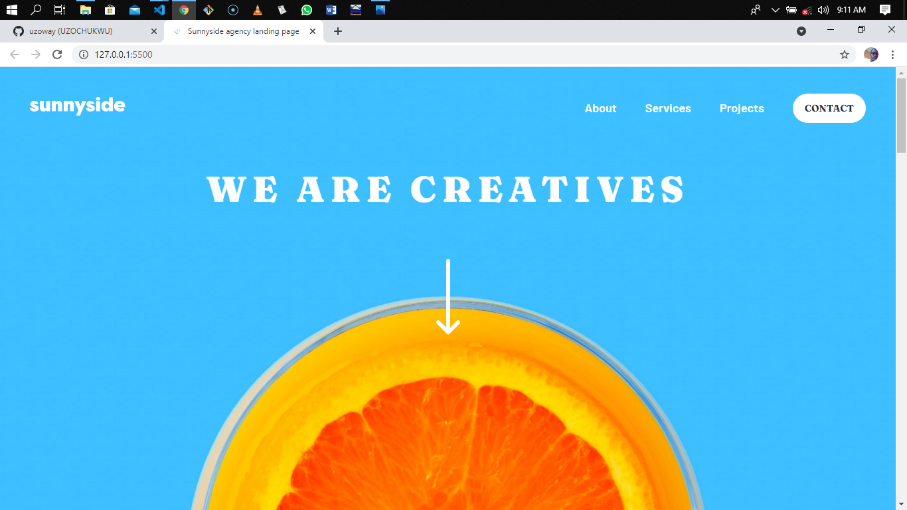

# Sunnyside agency landing page

This is a solution to the [Sunnyside agency landing page challenge on Frontend Mentor](https://www.frontendmentor.io/challenges/sunnyside-agency-landing-page-7yVs3B6ef). Frontend Mentor challenges help you improve your coding skills by building realistic projects.

## Table of contents

- [Overview](#overview)
  - [The challenge](#the-challenge)
  - [Screenshot](#screenshot)
  - [Links](#links)
- [My process](#my-process)
  - [Built with](#built-with)
  - [What I learned](#what-i-learned)
- [Author](#author)
- [Acknowledgments](#acknowledgments)

## Overview

### The challenge

Users should be able to:

- View the optimal layout for the site depending on their device's screen size
- See hover states for all interactive elements on the page

### Screenshot

### Links

- [Solution URL](https://www.frontendmentor.io/solutions/sunnyside-agency-landing-page-built-using-vanilla-js-html5-and-css3-Q0Jm-O-XO)
- [Live Site URL](https://sunnyside-agency-landing-page-omega.vercel.app/)

## My process

### Built with

- Semantic HTML5 markup
- CSS custom properties
- Flexbox
- CSS Grid
- Vanilla JavaScript

### What I learned

During the course of completing this project, I was able to sharpen my Frontend Development skills which includes HTML5, CSS3, JavaScript and Responsive web design.

## Author

- Github - [uzoway](https://github.com/uzoway)
- Frontend Mentor - [@uzoway](https://www.frontendmentor.io/profile/uzoway)
- LinkedIn - [Uzochukwu Victor Okafor](https://www.linkedin.com/in/uzochukwuokafor/)

## Acknowledgments

Like always, my gratitute goes to my amazing guys at [Frontend Mentor](https://www.frontendmentor.io) who are working effortlessly to put this challenges together to help Frontend Developers get practical knowledge while building out these projects.
